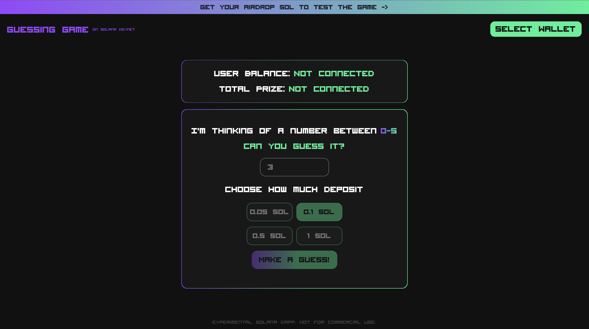

# Guess the Number on Solana Testnet

## Introduction

Welcome to "Guess the Number", an engaging blockchain game built on the Solana Testnet.

## Features

- **Wallet Connection**: Compatible with Phantom, Solflare, and Torus wallets for a secure and seamless gaming experience.
- **1 SOL Airdrop Request**: Players can request an initial 1 SOL airdrop to start playing, making the game easily accessible.
- **View Balance and Total Reward**: Keep track of your wallet balance and potential winnings directly within the game.
- **Guess a Number and Place Your Bet**: Guess a number between 0-5 and decide how much you want to bet.
- **Winning and Losing**: Correct guesses earn you double your bet (2x). Incorrect guesses contribute your bet to the game's SOL pool.
- **Testnet Exclusive**: This game operates on the Solana Testnet, with the potential for users to adapt it for the mainnet.

## Getting Started

1. **Connect Your Wallet**: Select and connect your preferred wallet (Phantom, Solflare, Torus).
2. **Request Airdrop**: New or low-balance players can request a 1 SOL airdrop.
3. **Play the Game**: Make your guess and place your bet.
4. **Win or Lose**: Enjoy your winnings for a correct guess, and try again if not.

## Screenshot

## Customization for Mainnet and Disclaimer

"Guess the Number" is primarily developed for entertainment and educational purposes on the Solana Testnet. Modifying it for the Solana mainnet carries risks, including financial loss, security, and regulatory issues. This customization should only be attempted by those with deep knowledge of Solana network operations. By adapting the game for mainnet use, you accept full responsibility for all associated risks and outcomes. The developers of "Guess the Number" are not liable for any potential damages or losses related to mainnet deployment or usage.

## Support and Contributions

For support, suggestions, or to contribute, please reach me through my [Telegram](https://t.me/fullstackweb3dev) or [Github Repository](https://github.com/web3xDev/GuessTheNumberGame-SolanaTestnet)

Happy gaming, and may luck be on your side!
